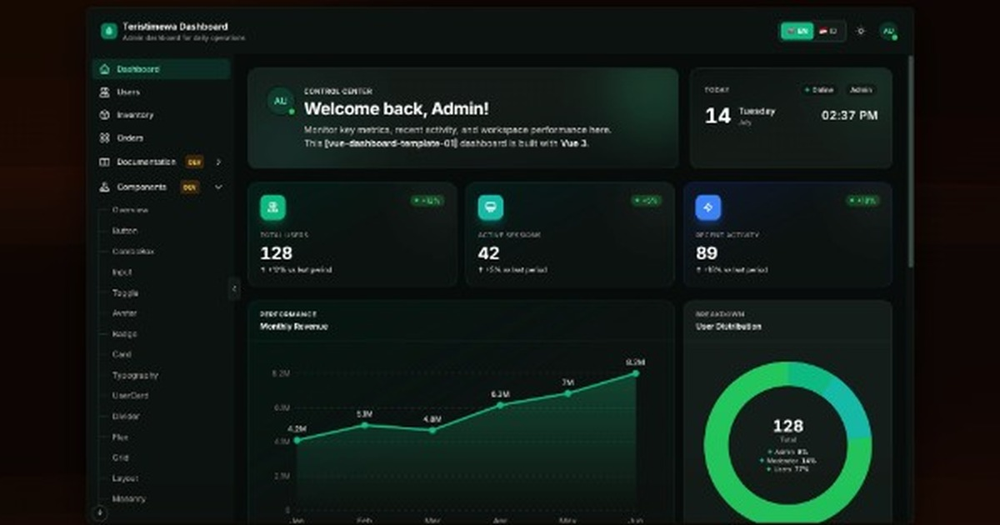

# Vue App Boilerplate

Starter Vue 3 dashboard siap produksi dengan Vite, TypeScript, Tailwind CSS, Pinia, dan Clean Layered Architecture.

**Live template preview:** [https://template.teristimewa.com/vue-dashboard-template-01](https://template.teristimewa.com/vue-dashboard-template-01)

<a href="https://template.teristimewa.com/vue-dashboard-template-01">
  
</a>

Choose Language / Pilih Bahasa:

- [English](./README.md)
- Bahasa Indonesia (dokumen ini)

> **Butuh detail lebih?** Install Volta → [VOLTA.id.md](./VOLTA.id.md) · Arsitektur, Pinia, API, halaman manual → [DOCUMENTATION.id.md](./DOCUMENTATION.id.md) · [DOCUMENTATION.md](./DOCUMENTATION.md)

## Yang Anda dapatkan

- **Auth** - login/register dengan route guards
- **Fitur** - Dashboard, Users (CRUD lengkap), Settings
- **i18n** - Inggris & Indonesia via `src/locales/` dan `useLocale()`
- **Scaffolding** - `make generate` untuk aplikasi baru, `make feature` untuk menu + halaman
- **Docs & komponen** - landing in-app (mode development) yang menaut ke Documentation dan Components terpublikasi

---

## Prasyarat

Instal alat berikut **sebelum** clone atau menjalankan aplikasi. Versi mengikuti [package.json](./package.json) (Volta-pinned).

> **Tooling yang disarankan:** Node **22.23.1** dan pnpm **11.17.0**. Utamakan [Volta](https://volta.sh) (lihat [VOLTA.id.md](./VOLTA.id.md)). **Tanpa Volta**, tetap install versi yang sama sendiri dan cek dengan `node --version` / `pnpm --version`.

| Alat        | Versi                           | Wajib            | Digunakan untuk             |
| ----------- | ------------------------------- | ---------------- | --------------------------- |
| **Node.js** | 22.x (22.23.1 direkomendasikan) | Ya               | Runtime & build             |
| **pnpm**    | 11.x (11.17.0 direkomendasikan) | Ya\*             | Install dependency & script |
| **Git**     | versi recent                    | Direkomendasikan | Clone repo, `make generate` |
| **make**    | GNU Make                        | Opsional         | Shortcut Makefile           |
| **rsync**   | any                             | Opsional         | Hanya `make generate`       |

\* npm bisa dipakai sebagai fallback, tetapi proyek ini ditest dengan **pnpm** (**11.17.0** via Volta; engines ≥11).

> **Catatan pnpm install:** Script build `esbuild` dan `vue-demi` sudah diizinkan di [`pnpm-workspace.yaml`](./pnpm-workspace.yaml) (`allowBuilds`). Jangan biarkan nilai placeholder - itu memicu `ERR_PNPM_IGNORED_BUILDS`.

### Aktifkan Volta (disarankan)

**Panduan lengkap (macOS zsh/bash, Linux/WSL bash/zsh, Windows PowerShell):**  
→ **[VOLTA.id.md](./VOLTA.id.md)** · [VOLTA.md](./VOLTA.md)

Dukungan pnpm di Volta masih eksperimental. Set `VOLTA_FEATURE_PNPM=1` agar pin pnpm jalan. Jika `echo $VOLTA_FEATURE_PNPM` kosong, lihat [VOLTA.id.md - Troubleshooting](./VOLTA.id.md#echo-volta_feature_pnpm-kosong).

**macOS (zsh)** (taruh Volta di **akhir** `~/.zshrc`, setelah nvm/fnm/asdf):

```bash
curl https://get.volta.sh | bash
# buka ulang terminal, lalu:
cat >> ~/.zshrc <<'EOF'

# Volta (taruh di akhir file agar menang dari nvm/fnm/asdf)
export VOLTA_FEATURE_PNPM=1
export VOLTA_HOME="$HOME/.volta"
export PATH="$VOLTA_HOME/bin:$PATH"
EOF
source ~/.zshrc
echo "$VOLTA_FEATURE_PNPM"    # expect: 1
volta install node@22.23.1 pnpm@11.17.0
which node                    # expect: ~/.volta/bin/node
```

**Shell / OS lain:** [macOS bash](./VOLTA.id.md#2-macos--bash) · [Linux/WSL bash](./VOLTA.id.md#3-linux--wsl--bash) · [Linux/WSL zsh](./VOLTA.id.md#4-linux--wsl--zsh) · [Windows PowerShell](./VOLTA.id.md#5-windows--powershell).

Setelah itu, setiap `cd` ke project mengaktifkan Node/pnpm yang di-pin (tidak perlu `volta pin`).

**Tanpa Volta?** Tetap pakai **Node 22.23.1** dan **pnpm 11.17.0**. Contoh: `brew install node@22` lalu `npm install -g pnpm@11.17.0`.

Panduan install per OS lengkap: [README.md - Install from scratch](./README.md#install-from-scratch).

---

## Quick Start

Dengan Volta + `VOLTA_FEATURE_PNPM=1` (lihat [Aktifkan Volta](#aktifkan-volta-disarankan) / [VOLTA.id.md](./VOLTA.id.md)), setelah `cd` ke repo, Node **22.23.1** dan pnpm **11.17.0** aktif otomatis.

```bash
git clone https://github.com/KutuGondrong/vue-dashboard-template-01.git
cd vue-dashboard-template-01
pnpm install
make dev
```

Buka **http://localhost:5173**. Login demo: `admin@mail.com` / `password123`

### Scaffold aplikasi sendiri (opsional)

```bash
make generate name=my-new-app
cd ../my-new-app
rm -rf ../vue-dashboard-template-01
pnpm install
make dev
```

Tanpa `make`:

```bash
git clone https://github.com/KutuGondrong/vue-dashboard-template-01.git vue-dashboard-template-01
cd vue-dashboard-template-01
node scripts/generate-app.mjs --name=my-new-app
cd ../my-new-app
rm -rf ../vue-dashboard-template-01
pnpm install
pnpm run dev
```

Output default: `../my-new-app` (folder saudara, di luar template). Path kustom: `make generate name=my-app out=~/projects/my-app`.

---

## Documentation & Components (mode development)

Saat `make dev`, sidebar menampilkan **Documentation** dan **Components** (badge DEV; `VITE_SHOW_DEV_FEATURES=false` untuk menyembunyikan). Halaman tersebut adalah landing yang membuka dokumentasi dan katalog komponen terpublikasi di tab baru.

Catatan arsitektur lengkap ada di [DOCUMENTATION.id.md](./DOCUMENTATION.id.md).

---

## Scaffolding

### `make generate` - aplikasi baru dari template

```bash
make generate name=my-new-app
make generate name=my-app out=~/projects/my-app
```

Membuat salinan di luar repo ini, memperbarui nama di `package.json`, dan menjalankan `git init` di folder output.

### `make feature` - menu + halaman

```bash
make feature name=inventory label="Inventory" label-id="Inventaris"
make feature name=reports scope=store label="Reports" label-id="Laporan"
make feature name=alerts scope=page label="Alerts" label-id="Peringatan"
```

| Parameter  | Wajib            | Deskripsi                                                                                                |
| ---------- | ---------------- | -------------------------------------------------------------------------------------------------------- |
| `name`     | Ya               | Kunci fitur: `src/features/<name>/`, route `/<name>`, locale `nav.<name>`. Gunakan lowercase kebab-case. |
| `label`    | Direkomendasikan | Label sidebar Inggris → `src/locales/en.json` (`nav.*`)                                                  |
| `label-id` | Direkomendasikan | Label sidebar Indonesia → `src/locales/id.json` (`nav.*`). Fallback ke `label` jika kosong.              |
| `scope`    | Tidak            | `full` (default), `store`, atau `page` (alias: `empty`)                                                  |

| Scope   | Yang di-generate                                                |
| ------- | --------------------------------------------------------------- |
| `full`  | halaman + table + Pinia store + usecase (mock data di usecase)  |
| `store` | halaman + table + Pinia store (mock inline, tanpa file usecase) |
| `page`  | halaman kosong + wiring menu/route/locale saja                  |

Selalu diperbarui: `src/router/featureRoutes.ts`, `src/layouts/sidebar/featureMenuItems.ts`, dan `nav.*` di file locale.

Wiring manual, mock vs real API, dan contoh kode lengkap → [DOCUMENTATION.id.md](./DOCUMENTATION.id.md#id-16-buat-halaman-baru--manual).

---

## Tanpa Make

| Alih-alih              | Jalankan                                         |
| ---------------------- | ------------------------------------------------ |
| `make dev`             | `pnpm dev`                                       |
| `make build`           | `pnpm format && pnpm build`                      |
| `make feature name=X`  | `node scripts/generate-feature.mjs --name=X ...` |
| `make generate name=X` | `node scripts/generate-app.mjs --name=X`         |

```bash
node scripts/generate-feature.mjs --name=inventory --label="Inventory" --label-id="Inventaris"
node scripts/generate-app.mjs --name=my-app --out=~/projects/my-app
```

---

## Perintah Makefile

| Perintah                                                                               | Deskripsi                                                                   |
| -------------------------------------------------------------------------------------- | --------------------------------------------------------------------------- |
| `make dev`                                                                             | Vite dev server (Documentation & Components dengan badge DEV)               |
| `make build`                                                                           | Format, type-check, production build (landing DEV tidak ikut di production) |
| `make lint`                                                                            | ESLint + TypeScript check                                                   |
| `make format`                                                                          | Prettier + ESLint auto-fix                                                  |
| `make preview`                                                                         | Serve build produksi secara lokal                                           |
| `make clean`                                                                           | Hapus `dist`, `node_modules/.vite`                                          |
| `make generate name=my-app [out=PATH]`                                                 | Scaffold aplikasi di luar folder template                                   |
| `make feature name=X [scope=full\|store\|page] label="English" [label-id="Indonesia"]` | Scaffold menu + halaman                                                     |
| `make test-feature`                                                                    | Jalankan tes script generate-feature                                        |

---

## Struktur proyek

Layout berlapis di `src/` (`config`, `router`, `locales`, `models`, `datasource`, `components`, `layouts`, `features/<name>/`). Diagram lengkap dan aturan lapisan → [DOCUMENTATION.id.md § Struktur Proyek](./DOCUMENTATION.id.md#id-8-struktur-proyek).

---

## Environment

| Variabel                    | Fungsi                                                     |
| --------------------------- | ---------------------------------------------------------- |
| `VITE_API_BASE_URL`         | Base URL backend                                           |
| `VITE_SHOW_DEV_FEATURES`    | Tampilkan atau sembunyikan menu Documentation & Components |
| `VITE_ENABLE_SCROLL_TO_TOP` | Tombol scroll-to-top (default: true)                       |

Set `previewUrl` di `src/config/external-links.json` (atau `VITE_OG_SITE_URL` di `.env.production`) ke URL deploy agar preview link memakai `public/og-image.jpg`.

Lihat `.env` untuk default. Override dev/production dan deployment → [DOCUMENTATION.id.md § Deployment](./DOCUMENTATION.id.md#id-18-deployment).

---

## Bacaan lanjutan

| Dokumen                                      | Isi                                               |
| -------------------------------------------- | ------------------------------------------------- |
| [VOLTA.id.md](./VOLTA.id.md)                 | **Install Volta** (macOS / Linux / Windows)       |
| [DOCUMENTATION.id.md](./DOCUMENTATION.id.md) | **Panduan developer mendalam** (Bahasa Indonesia) |
| [DOCUMENTATION.md](./DOCUMENTATION.md)       | Deep developer guide (English)                    |
| [README.md](./README.md)                     | Ringkasan ini (English)                           |

Landing **Documentation** / **Components** (badge DEV) saat `make dev` menaut ke panduan interaktif terpublikasi.

---

## Stack

- Vue 3 + TypeScript
- Vite 5
- Tailwind CSS 3
- Vue Router 4 + Pinia
- Axios dengan interceptors
- Volta-pinned Node 22.23.1 / pnpm 11.17.0
